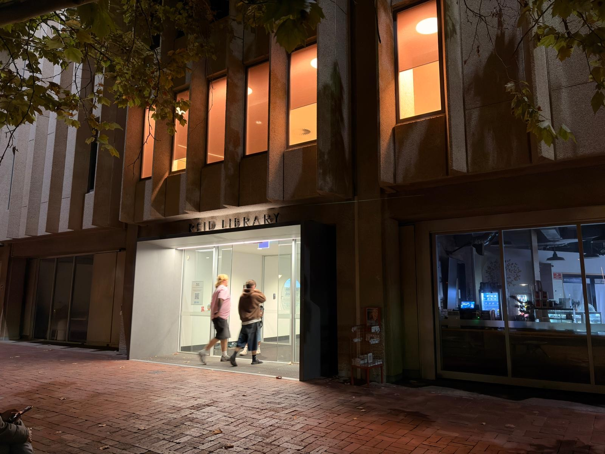

# B1. Discover 5 unique weak/vulnerable security implementations.

## 1. Easy tailgating into controlled spaces

One unique weak security implementation I discovered was easy tailgating through the controlled entry gate at the ground floor of UWA’s Reid Library after normal operating hours. I only started noticing this more carefully because I had been staying in the library late recently to study for the upcoming semester final exams, and one night it caught my attention. There is clear information around the library explaining that access becomes restricted to the general public after standard hours, which shows that the university has already tried to put a proper access-control system in place. The idea behind it is actually strong in theory: students are supposed to scan their student ID card to unlock the entry gate, so only authorised users should be able to enter. However, what I observed that night was that after one person scanned their card and opened the gate, two or three other people followed directly behind them without scanning anything themselves, entering before the gate had time to close again. That made me realise that this is a weak security implementation not because there is no control at all, but because the system fails to verify each individual person entering the premises. In other words, the security measure depends too heavily on the assumption that only one person will pass per scan, and that assumption can be broken very easily in practice. After seeing this, I understood that the weakness here is a form of access-control bypass through tailgating, where the gate mechanism works, but the real-world implementation is not strict enough to stop unauthorised entry during busy or distracted moments. This fits the activity well because it was something I physically noticed myself, it made me think more deeply about how access control works in real life, and it showed me that even a good security idea can still become vulnerable if the implementation does not properly enforce one-person-at-a-time entry.

