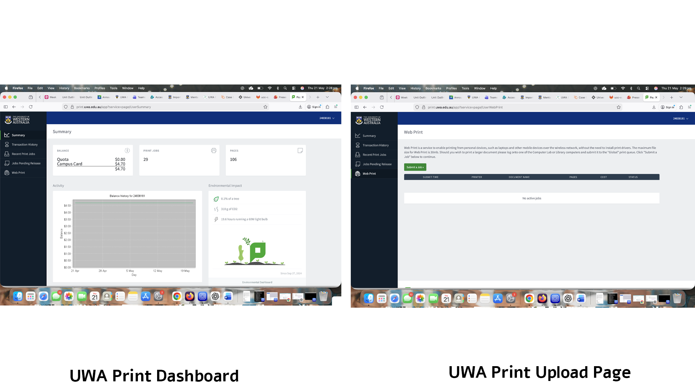
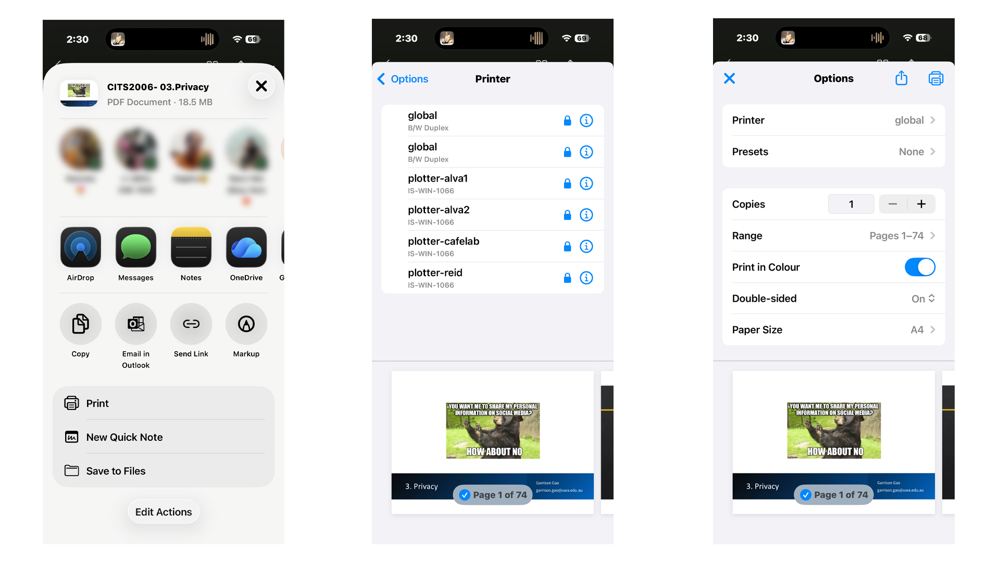

# B2. Discover 5 unique strong security implementations.

## 1. Wi-Fi requiring individual credentials instead of one shared password

One strong security implementation I discovered is the way UWA’s main Wi-Fi network requires individual credentials instead of one shared password for everyone. This stood out to me because it is very different from the usual setup in many homes, cafés, or other places where one common password is given to everyone using the network. At UWA, the wireless network is designed so that only authorised students and staff can access it using their own personal login details, which are usually their student or staff credentials linked to their university account. I found this to be a very strong implementation because it makes the network much more controlled and accountable. Instead of one password being shared around endlessly, each user is tied to their own identity, which means access is limited to genuine members of the university community. It also reduces the risk of outsiders casually joining the network and makes it easier for the university to manage access properly. After noticing this, I understood that this is not just a convenient login method, but a much stronger network security design because it combines authentication, identity, and controlled access in a far more secure way than a single shared Wi-Fi password ever could.

**Figure: University wifi login credentials**

## 2. Guest Wi-Fi separated from the main/private network

Another strong security implementation I discovered is that UWA separates its guest Wi-Fi from the main internal university network. I found that the internet on campus is not simply open to the general public. Instead, the university distinguishes between students and staff using the main trusted network and official guests using a separate guest network. This is a very strong implementation because it shows that the university is not treating every internet user on campus the same way. If guests were placed directly onto the same network as trusted internal users, that could create unnecessary exposure and risk. By keeping the guest network separate, UWA allows visitors to access the internet without giving them the same level of access as students and staff. I found this especially effective because it reflects a more thoughtful approach to network security: the university is still being practical and welcoming to visitors, but it is doing so without weakening the protection of its main systems. After learning more about it, I realised that this separation is important because it supports network segmentation, which is a strong security principle that helps reduce risk by limiting how far access can spread.

**Figure: Guest Portal Login Info**

Reference Link: https://ipoint.uwa.edu.au/app/answers/detail/a_id/682/~/internet-in-the-library

## 3. Physical security key or hardware token used for login

A really good strong security implementation I discovered was the tight card-based access control used for the Dickinson Resource Room on the ground floor of Reid Library. What made this stand out to me is that it is not just a normal locked room. The room is there to support disabled students, and access is clearly restricted to people who have actually been granted permission to use it. I noticed that simply having a university card was not enough on its own. The door would only open when the card being scanned belonged to someone who had specifically been given access rights for that room. This shows a strong implementation of digital access control because the system is not only checking whether the person is a student, but whether they are authorised for that exact resource. I also noticed that the door closes again very quickly after opening, which helps reduce the chance of tailgating or unauthorised people slipping in behind someone else. What I liked about this implementation is that it combines two things well: identity-based access and practical physical follow-through. After observing it more carefully, I understood that this is a strong security implementation because it does not rely on general trust or broad access, but instead applies access rights in a very specific and controlled way.

**Video Evidence Attached on Github**

Reference: https://www.uwa.edu.au/library/visit-our-libraries/library-spaces/accessibility

## 4. Secure printing with release code or staff card tap

Another very strong security implementation I came across was UWA’s secure printing system inside the libraries. I found this particularly impressive because it protects both security and privacy in a very practical way. Students and staff can upload their documents to be printed through the university system, but the printer does not immediately start printing the moment the file is sent. Instead, the print job stays waiting until the user physically goes to the printing station and scans their student card to release it. I think this is a very strong design because it prevents documents from being left out in the open where someone else could see, take, or misuse them. In a shared environment like a university library, that is very important, especially when students may be printing assessments, identification forms, financial documents, or other private materials. I also like that the system allows the user to log out afterwards, which adds another layer of protection in a shared printing environment. After noticing how this worked, I realised that this is a strong security implementation because it does not only focus on getting the job done, but also on making sure that documents are released only to the rightful person at the correct time and place.

**Figure: Secure printing from mobile phone as well as from their website**

## 5. Bank Transactions Security

A strong security implementation I discovered in everyday digital life is the way the international banking app Wise handles fund transfers with repeated confirmation and clear transaction review steps. What I found especially good about this is that the app does not rush the user into sending money immediately. Instead, when making a transfer, it presents the payment details very clearly and repeatedly, including who the money is going to, the amount, and the full transaction summary. I noticed that this information is shown again and again across multiple screens, which at first may seem repetitive, but after thinking about it more, I realised that this is actually a very strong implementation. It protects users from accidental transfers, wrong recipients, and careless mistakes by forcing them to slow down and properly review what they are doing. In financial systems, one of the biggest risks is not always hacking in the dramatic sense, but simple human error, such as sending money to the wrong person or misunderstanding the transaction details. What Wise does well is that it uses its interface as a security feature. By making the information large, clear, and repeated at several stages, the app helps the user confirm their actions properly before the transfer is finalised. I found this to be a strong implementation because it supports secure decision-making, not just technical protection in the background.

**Figure: Wise transaction pages**
