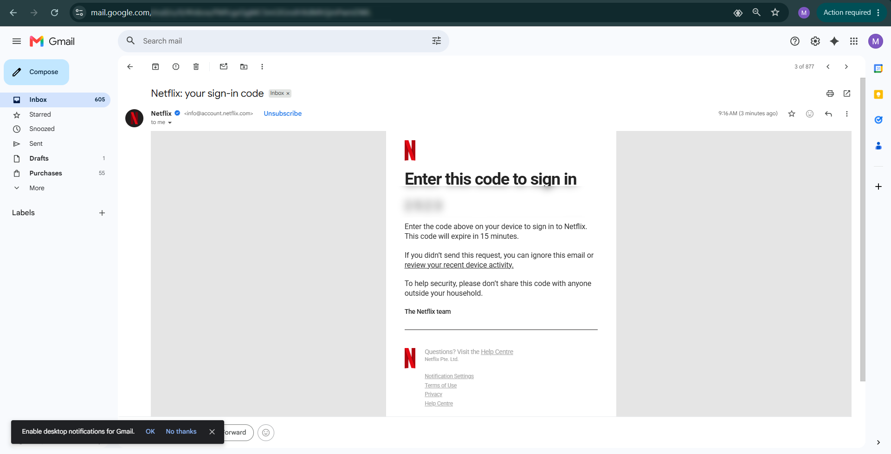

# B3. Discover 3 proactive security implementations in practice.

## 1. One-time or expiring verification links/codes

One proactive security implementation I discovered in practice was the use of one-time or quickly expiring verification codes for account access. I noticed this when I was trying to sign in to my Netflix account from another device. Instead of forcing me to use only the normal password method, Netflix provided another sign-in pathway using a verification code. What stood out to me is that when this code was sent, the service clearly stated that it would expire very quickly, which meant it could not be reused freely or kept valid for a long period. I found this to be a strong proactive security implementation because it reduces the value of stolen or intercepted authentication material. Even if someone were somehow able to see the code, it would only be useful for a very short time and only for that particular login moment. That makes the system stronger than relying only on a static password, which can be reused again and again if compromised. What I liked about this implementation is that it protects the account before misuse happens, by limiting the time window in which the code is useful and by making the authentication step more temporary and controlled.

**Figure: Netflix one-time code verfication**

## 2. External email warning banners and caution alerts for suspicious files

Another proactive security implementation I discovered was the use of warning banners or caution alerts for potentially risky emails and attachments. I noticed something very similar in Gmail when I received a very large file from a sender and the email service warned me beforehand that the file had not been scanned for viruses and could potentially be harmful if I was not careful. It specifically urged me to proceed with caution, which I found to be a very good example of proactive security in practice. What makes this implementation strong is that it gives the user an early warning before they open, download, or trust the file too quickly. Instead of reacting only after damage is done, the email system tries to reduce risk at the point where the decision is being made. I found this especially useful because many people treat attachments casually, especially if they look work-related or come from a normal-looking sender. By placing a visible warning in front of the user, the service creates an extra pause and encourages safer judgment. That is why I see this as a proactive implementation: it tries to stop a dangerous action before it turns into an actual infection or security problem.

**Figure: Gmail warning sign**

## 3. Suspicious login alerts and identity confirmation for unusual sign-ins

The third proactive security implementation I discovered was the use of suspicious login alerts for unusual sign-ins, especially on Facebook. I have seen that whenever I log in from a device, browser, or location that the system does not fully recognise, Facebook often sends alerts and additional checks until I confirm that it was really me. I found this to be a very good proactive security measure because it does not wait passively for the account to be abused. Instead, it actively monitors login behaviour and responds when something appears unusual. What makes this strong is that it gives the real account owner a chance to act early, for example by confirming the login, rejecting it, or taking steps to secure the account if the attempt was not genuine. I understood this as proactive because the system is trying to detect risky behaviour at the entry point, before an attacker has time to fully take control of the account or misuse its information. In practice, this kind of alert can make a very big difference, because it creates an opportunity to stop account compromise early rather than only discovering it after something has already gone wrong.

**Figure: Suspicious log-activity notification by gmail**
