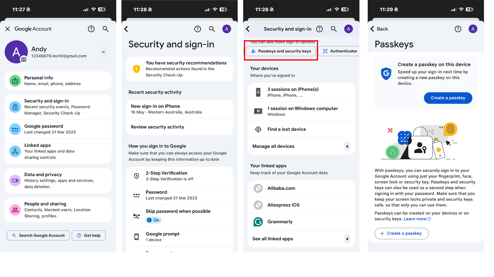

# B17. Implement one of the current state-of-the-art solutions and evaluate it.

For this activity, I chose to implement passkey-based authentication as one of the current state-of-the-art cybersecurity solutions. I selected this because passkeys are now widely recognised as a much stronger alternative to normal passwords, especially against phishing and credential theft. Organisations such as CISA, Google, and Microsoft all promote stronger, phishing-resistant authentication, and passkeys are a very practical example of that. What made this a good choice for me is that it was not only something I could research in theory, but something I could actually enable and use in my own daily digital life. Because of that, I decided to turn on the passkey option for my day-to-day Google account and then evaluate how useful and effective it really felt in practice. 

To implement the solution, I went into the security settings of my Google account and enabled the passkey option. Once it was set up, the account could rely more on the secure authentication already connected to my device, such as its biometric or screen-lock system, instead of depending only on a traditional password. I found the setup process quite smooth and not difficult to follow. That itself was important to me, because one of the reasons many people avoid stronger security is that they think it will be too technical or too inconvenient. In this case, the process felt modern and manageable, and Google’s own explanation of passkeys as a simpler and safer alternative to passwords made much more sense after I had actually tried it myself. 

When I evaluated the solution, the first thing I noticed was that it improved the sign-in experience in a meaningful way. Compared with the older habit of typing a password and then sometimes completing extra verification, passkey sign-in felt faster and more natural. Since I use this Google account regularly, that difference was noticeable in day-to-day use. It reduced the mental effort of remembering and entering the password each time, which made the process feel smoother without making it feel weaker. In fact, it felt stronger. That is what I found most impressive about it: the solution improved both security and convenience at the same time, which is not always common in cybersecurity.

From a security point of view, I found the passkey especially valuable because it reduces one of the biggest everyday risks, which is phishing. With a normal password, a user can still be tricked into entering it on a fake website or handing it over through a scam. With a passkey, the login process is much more closely tied to the trusted device and authentication method, which makes that kind of phishing attack much harder to pull off. This made the implementation feel much more meaningful than simply “adding another login option.” It was actually changing the way my account proves identity in a stronger way. That is why I felt it clearly matched the idea of a current state-of-the-art solution rather than just another minor security setting.

At the same time, my evaluation also made me think about a small limitation. The passkey felt easiest and most convenient because it was connected to a device I already trust and use regularly. That means the experience depends quite a lot on having access to that trusted device and being comfortable with that ecosystem. So while I found the solution very strong, I also realised it is something users need to understand properly so they know how their authentication is now working and what device it depends on. Even with that limitation, my overall judgment was still very positive, because the practical benefits clearly outweighed the inconvenience.
Overall, I think this activity was very worthwhile because I did not just read about a modern cybersecurity solution — I actually implemented it on my own Google account and evaluated how it performed in real use. My conclusion is that enabling a passkey was a very strong and meaningful improvement. It made my sign-in process smoother, reduced my reliance on passwords, and gave me stronger protection against phishing-style attacks. Because of that, I would consider this implementation successful and practical enough to recommend for everyday personal account security.

**Figure: Passkey generation process**
