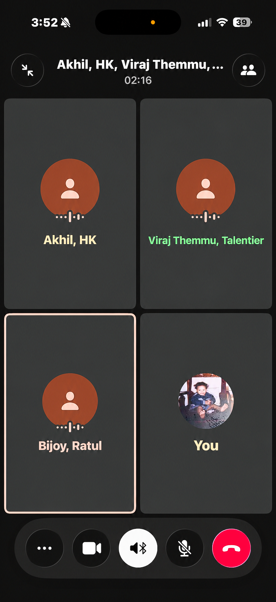

# B21. Design and implement a cybersecurity learning activity.

For this activity, I designed and implemented a screen and screenshot privacy workshop as a cybersecurity learning activity. I worked on this together with my big brother, and we decided to run the activity with three of his employees at his AI solutions company. He felt that this would be a very useful exercise for his team because they handle many clients every day, and because of that, even small privacy mistakes can become serious problems if sensitive information is exposed accidentally. I agreed with that immediately, because in companies that work closely with clients, screenshots and pictures are shared very often for bug reporting, communication, progress updates, and technical support. That means employees can sometimes reveal confidential details without even realising it. I chose this topic because it is practical, highly relevant to their daily work, and a very good example of how cybersecurity and data privacy are not only about complex hacking, but also about ordinary actions that people do all the time.

When designing the activity, I wanted it to feel interactive, simple, and memorable, rather than sounding like a dry lecture. Because of that, I created a fun exercise game on the Kahoot website where the participants had to look at different screenshot-style examples and decide which ones leaked sensitive information and which ones did not. I designed the workshop this way because I wanted them to actively think and make decisions instead of only listening to me explain the topic. The idea was to train them to look more carefully at what a screenshot might contain, such as names, email addresses, internal chat messages, browser tabs, file names, client details, meeting links, profile pictures, or other background information that may accidentally reveal private or internal company data. I felt this design worked especially well because their job already involves dealing with many clients and digital materials, so the exercise matched situations they could realistically face in their work environment.

When we implemented the workshop, the activity became much more informative and helpful than I had even expected. As the Kahoot game progressed, it became clear that several of the participants had not fully realised how easily data could be leaked through screenshots and images. Some of the examples looked harmless at first, but once we discussed them together, they began to notice how much hidden or side information could still be exposed. That was one of the most useful parts of the activity, because it showed that privacy mistakes do not always come from bad intentions or obvious negligence. Sometimes they happen simply because people are moving too quickly and do not check the whole screen before sharing it. After each question, I explained the reasoning clearly so that the activity was not only a game, but also a proper learning session that helped them understand what to watch out for in the future.

Overall, I found this activity very meaningful because it clearly matched the purpose of designing and implementing a cybersecurity learning activity. It was something I planned carefully, created with a real audience in mind, and then delivered in a practical way. The workshop had a clear purpose, which was to improve awareness of data privacy risks in screenshots and shared images, especially in a company that works with many clients. The outcome was positive because the employees became much more aware of how easy it is to expose internal or client-related information accidentally, and they left the session with a stronger habit of checking images properly before sharing them. I think this made the activity genuinely successful, because it was not only engaging and enjoyable, but also directly useful to their real work.

**Figure: Having a meeting for this activity**

Kahoot link: https://create.kahoot.it/details/7ace4944-33fd-4bff-927c-bbdfbfdd6ece
