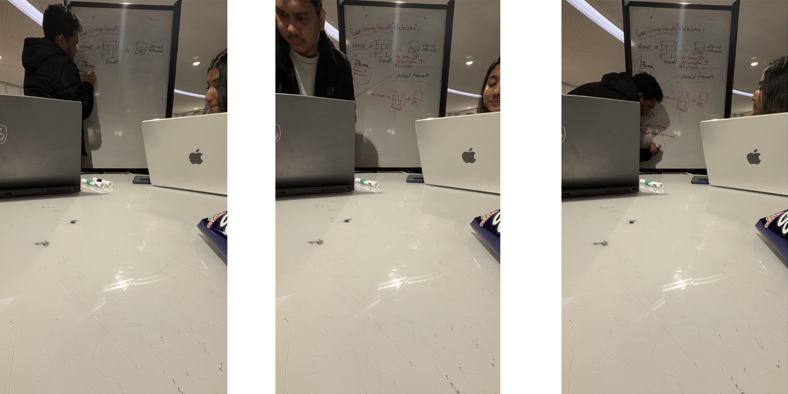

# B26. Help another student in this unit struggling to understand/learn a cybersecurity concept.

For this activity, I helped another student in this unit, Ann Maria Saji, who was struggling to understand the topic of types of firewalls and how they differ. She told me that this topic felt confusing because many of the firewall terms sounded similar, but the actual differences between them were not very clear to her. In particular, she was having difficulty understanding the difference between a packet filtering firewall and a stateful firewall, what an application proxy firewall actually means, and the difference between lower-level checking and application-level checking. Since these ideas are closely related and use similar vocabulary, I could understand why they felt hard to separate properly. This was especially important for her to understand well because it would help her prepare more confidently for the upcoming Lab Quiz 2.

To help her, we sat down together one day in the library and went through the topic carefully step by step. I did not want to just throw definitions at her, because that often makes technical concepts feel even more confusing. Instead, I started from the most basic idea, which is what a firewall does in general. I explained that a firewall is there to inspect traffic and decide what should be allowed through and what should be blocked. From there, I broke the topic into the three exact parts she was finding difficult. First, I explained that a packet filtering firewall checks packets mainly using fixed rule-based information such as IP addresses, protocols, and port numbers, and that it treats each packet more independently. Then I contrasted that with a stateful firewall, which not only checks packet information but also keeps track of the state or context of an ongoing connection. I told her that this is why a stateful firewall can make smarter decisions, because it knows whether a packet belongs to an already established session instead of treating it as completely isolated traffic.

After that, we spent time on the part she found most abstract, which was the application proxy firewall. I explained it to her in a more intuitive way by saying that instead of just quickly checking low-level traffic details, a proxy firewall acts more like a middle layer between the user and the service, and it can inspect traffic at the application level. This led naturally into the third confusion point, which was the difference between lower-level checking and application-level checking. I explained that lower-level checking usually focuses on more basic network information such as addresses, ports, and protocols, while application-level checking goes deeper into the actual service or application communication itself. We discussed that this is why application proxy firewalls can provide more detailed inspection, but they are also more complex than simpler firewall types. I made sure not to rush through these explanations, and we spent a good amount of time comparing the firewall types side by side until the differences became clearer to her.

By the end of our discussion, I could see that Ann understood the topic much better than before. She was able to explain back to me, in her own words, how packet filtering and stateful firewalls differ, what makes an application proxy firewall special, and why different levels of checking matter in practice. I found this activity really meaningful because it showed me that helping someone learn is not only about giving them the answer, but also about finding a way to explain confusing ideas more clearly and patiently. Overall, I felt that I was able to genuinely help her strengthen her understanding of this cybersecurity concept, and that made this a very worthwhile activity for both of us.

**Figure: Helping Ann with some topics she was struggling with**

**Video timelapse  Evidence on Github**
