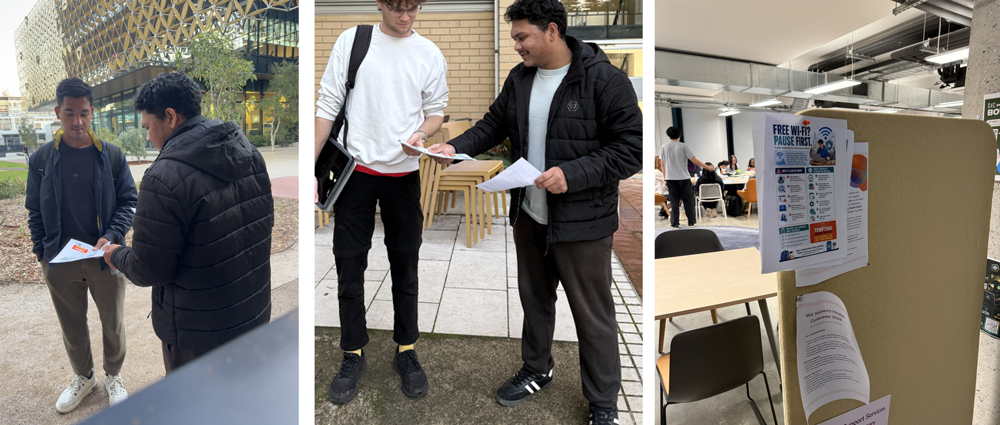
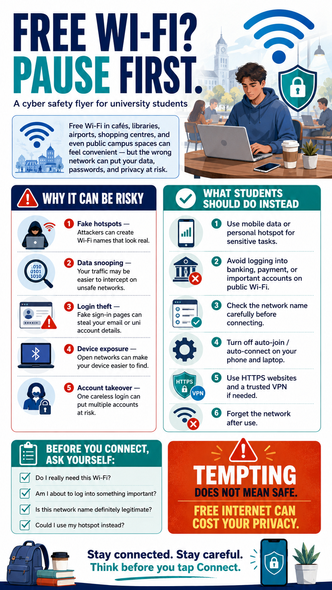

# B28. Produce a cyber safety flyer for (choose 1): elders, high school students, CEOs, Uni students.

For this activity, I decided to create a cyber safety flyer for university students about the risks of using free public Wi-Fi. I chose this topic because it feels very relevant to student life. University students often study in cafés, libraries, airports, shopping centres, and other public places where free Wi-Fi feels convenient and tempting to use. In many cases, students are busy, tired, or in a hurry, so connecting quickly can feel harmless. However, I wanted the flyer to show that this small and very normal decision can sometimes create real privacy and security risks. I felt this was an important issue to focus on because students often use public networks while checking emails, logging into study platforms, opening personal accounts, or accessing payment-related services, without always thinking about what could go wrong.

When designing the flyer, my goal was to make it clear, practical, and understandable for everyone, not just for people with a cybersecurity background. A university is made up of students from many different courses, countries, and levels of technical understanding, so I did not want to create something full of jargon or complicated cybersecurity terms. Instead, I structured the flyer around very simple and relatable ideas: why free public Wi-Fi can be risky, what students should do instead, and what they should ask themselves before connecting. I also used short warning points, a checklist-style section, and clear visual contrasts so that the message could be understood quickly even by someone who is not familiar with cybersecurity. My main purpose was awareness, so I wanted the flyer to be something that could catch attention immediately and still leave the reader with very practical advice they could actually follow.

In the flyer itself, I included the idea that public Wi-Fi can be dangerous because students may accidentally connect to fake hotspots, expose their traffic on unsafe networks, or risk losing login details through fake sign-in pages. I then balanced that warning with clear actions students can take instead, such as using mobile data or a personal hotspot for sensitive tasks, avoiding important logins on public Wi-Fi, checking network names carefully, turning off auto-connect, and forgetting the network after use. I also added a short “before you connect” checklist so that the flyer does not only warn people but also gives them a simple way to pause and think. I wanted the tone to feel cautionary but not dramatic, because if the flyer is too extreme people may ignore it. My aim was to make students feel that this is a real risk, but also one they can manage with a few sensible habits.
After creating the flyer, I made sure to use it for its main purpose, which was raising awareness. I distributed some printed copies on campus and also put one up on a noticeboard so that it would have more visibility and reach more students. I felt this was an important part of the activity because a cyber safety flyer only becomes meaningful when it is actually seen by the people it is meant to help. Overall, I found this activity very worthwhile because it allowed me to take a common but underestimated security issue and turn it into something simple, visual, and useful for everyday student life.

**Figure: Flyer distribution and Advertised on the Notice Board at E-Zone North**

**Figure: Original Flyer Design**

